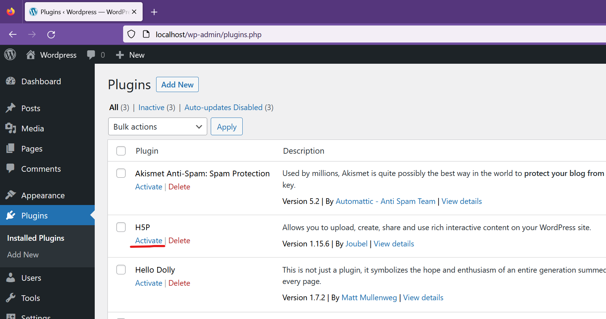

# h5p-wordpress-docker-devenv

`docker compose up -d`

Visit http://localhost and perform a basic installation of wordpress itself.

After, install H5P plugin by uncommenting volume in docker-compose.yml
(assuming this folder is clone of github.com/h5p/h5p-wordpress-plugin)
and then `docker compose up -d` again for the bind mount to appear in the
container.

If the contents of the folder is our wordpress plugin, you should now be able
to activate the plugin via the admin interface http://localhost/wp-admin/plugins.php

